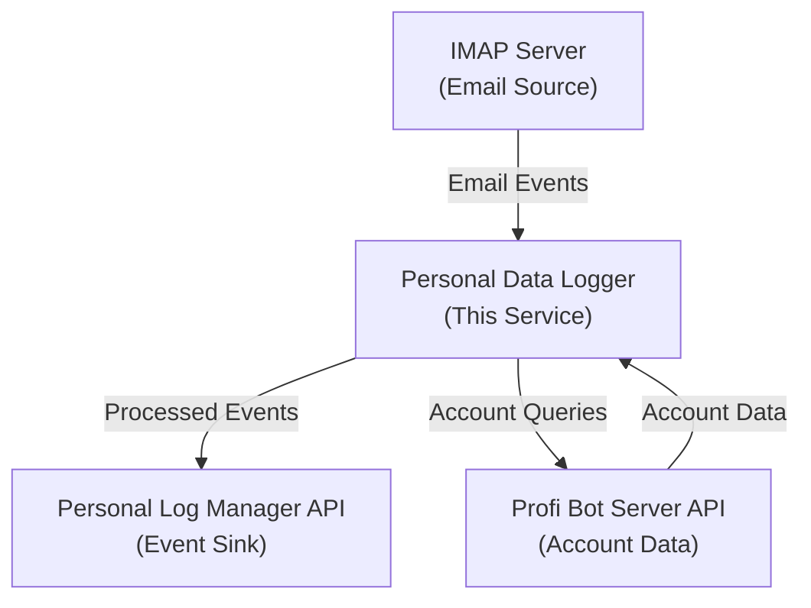
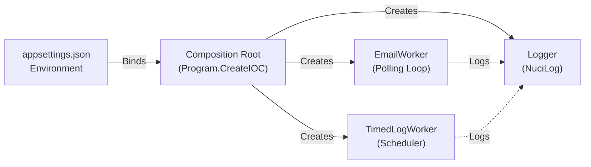
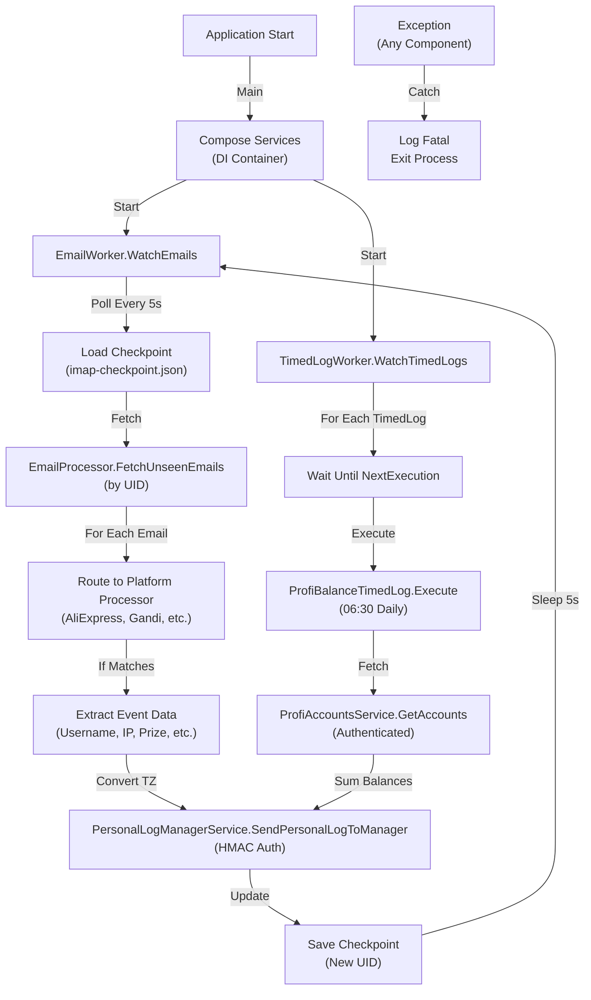
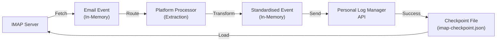
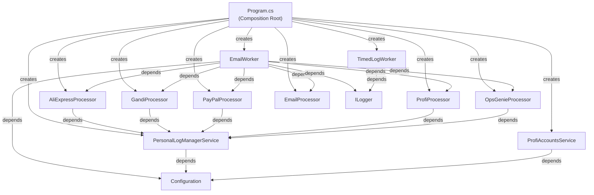

# Personal Data Logger Architecture

This document describes the current architecture of Personal Data Logger, a .NET 10 background service that polls an IMAP inbox, processes email events from multiple platforms, executes scheduled timed logs, and forwards all events to a Personal Log Manager API.

## 📑 Table of Contents

- [Purpose](#-purpose)
- [System Context](#-system-context)
- [Architectural Style](#-architectural-style)
- [Runtime Flow](#-runtime-flow)
- [Components](#-components)
- [Data Architecture](#-data-architecture)
- [Interfaces and Integrations](#-interfaces-and-integrations)
- [Dependency Direction and Rules](#-dependency-direction-and-rules)
- [External Dependencies](#-external-dependencies)
- [Deployment and Operations](#-deployment-and-operations)
- [Testing and Verification](#-testing-and-verification)
- [Design Constraints](#-design-constraints)
- [Cross-Cutting Concerns](#-cross-cutting-concerns)
- [Source Map](#-source-map)

## 🎯 Purpose

This architecture document describes the runtime structure, component responsibilities, data flows, and integration boundaries of Personal Data Logger. The service operates as a standalone .NET console application designed to run continuously as a background process. Its primary responsibility is to monitor an IMAP inbox for email events, apply transformations and filtering rules, and forward standardised event records to a centralised Personal Log Manager API. The document is intended for contributors who need to understand request flows, locate component ownership, and evaluate the impact of changes on event processing semantics, API contracts, and deployment constraints.

## 🌐 System Context

Personal Data Logger operates at the boundary between an IMAP mailbox and a Personal Log Manager API. The service receives email notifications from multiple external platforms (AliExpress, Gandi, PayPal, Profi, Opsgenie) and transforms them into standardised event records. A secondary flow executes scheduled timed logs (e.g., Profi Bot account balance collection) on a daily schedule. All processed events are transmitted to the Personal Log Manager API with timestamps converted to Romanian time.



The principal external boundaries are:

- **IMAP Server:** Inbound email notifications from AliExpress, Gandi, PayPal, Profi, and Opsgenie. The service polls continuously and maintains a checkpoint to prevent duplicate processing.
- **Personal Log Manager API:** Outbound HTTP API for submitting processed events with HMAC authentication and timezone conversion.
- **Profi Bot Server API:** Outbound HTTP API for retrieving authenticated account data (balances, enabled status) during scheduled timed logs.

## 🏗️ Architectural Style

Personal Data Logger implements a **concurrent pipeline pattern** with two independent worker threads orchestrated by a composition root. The service uses **dependency injection** (Microsoft.Extensions.DependencyInjection) to wire components and promote testability. The architecture emphasises **separation of concerns**: email polling and timed log execution are independent workers that may terminate independently, and platform-specific event extraction is delegated to pluggable processors.



The principal architecture boundaries are:

- **Composition Root** (`Program.cs`): Initialises configuration, registers dependencies, and starts two independent worker tasks.
- **Email Worker** (`Service/EmailWorker.cs`): Polls IMAP, maintains checkpoint state, and dispatches emails to platform-specific processors.
- **Timed Log Worker** (`Service/TimedLogWorker.cs`): Schedules and executes registered timed logs (currently `ProfiBalanceTimedLog`).
- **Processors** (`Service/Processors/`): Platform-specific email extraction and event transformation (AliExpress, Gandi, PayPal, Profi, Opsgenie).
- **Client Services** (`Client/`): External API integrations (Personal Log Manager, Profi Bot Server).

## 🔄 Runtime Flow



The principal runtime sequence is:

1. **Application Start**: Entry point in `Program.Main()` creates the DI service provider and retrieves `IEmailWorker` and `ITimedLogWorker`.
2. **Worker Startup**: Two independent `Task.Run()` calls start `EmailWorker.WatchEmails()` and `TimedLogWorker.WatchTimedLogs()`. The main thread waits for the first worker to complete or throw.
3. **Email Polling Loop**: `EmailWorker` polls IMAP every 5 seconds. On each iteration, it loads the checkpoint (UID validity and last processed UID), fetches emails newer than the checkpoint, routes each email to a platform-specific processor, and saves the checkpoint after successful processing.
4. **Scheduled Execution Loop**: `TimedLogWorker` iterates through registered `ITimedLog` implementations, calculates the next execution time for each, sleeps until that time, and executes the log (currently only `ProfiBalanceTimedLog` at 06:30 daily).
5. **Error Handling**: Unhandled exceptions in either worker are caught at the composition root, logged as fatal, and cause the process to terminate.

## 🧩 Components

| Component | Responsibility | Principal Dependencies | Lifetime or Ownership |
|-----------|----------------|------------------------|-----------------------|
| `EmailWorker` | Polling loop: IMAP login, checkpoint load/save, email retrieval, platform routing, API dispatch | `IEmailProcessor`, five `I*Processor` implementations, `ImapSettings`, `ILogger` | Singleton, retrieved in `Main()` |
| `TimedLogWorker` | Scheduler: iterate registered `ITimedLog` implementations, calculate next execution, execute at scheduled time | `IEnumerable<ITimedLog>`, `ILogger` | Singleton, retrieved in `Main()` |
| `ProfiBalanceTimedLog` | Daily schedule (06:30): retrieve Profi accounts, sum balances for enabled accounts, send as timed log event | `IProfiAccountsService`, `IPersonalLogManagerService` | Singleton, registered in `ServiceCollection` |
| `EmailProcessor` | IMAP connectivity: login, UID validity check, fetch emails by UID range | `ImapSettings`, `ILogger` | Singleton, injected into `EmailWorker` |
| `AliExpressProcessor` | Platform extraction: detect verification code emails, parse email address, emit account login event | `IPersonalLogManagerService` | Singleton, injected into `EmailWorker` |
| `GandiProcessor` | Platform extraction: detect new device connection, parse username and IP address via regex, emit account login event | `IPersonalLogManagerService` | Singleton, injected into `EmailWorker` |
| `PayPalProcessor` | Platform extraction: detect new device connection (Romanian), parse email address via regex, emit account login event | `IPersonalLogManagerService` | Singleton, injected into `EmailWorker` |
| `ProfiProcessor` | Platform extraction: detect prize-winning emails, parse account ID and prize description via regex, emit prize event | `IPersonalLogManagerService` | Singleton, injected into `EmailWorker` |
| `OpsGenieEmailProcessor` | Platform extraction: detect on-call rotation changes, emit shift beginning/ending events | `IPersonalLogManagerService` | Singleton, injected into `EmailWorker` |
| `PersonalLogManagerService` | API client: format events, convert timezone to `Europe/Bucharest`, send HTTP POST with HMAC authentication | `PersonalLogManagerSettings`, HTTP client (implicit) | Singleton, injected into processors and timed logs |
| `ProfiAccountsService` | API client: authenticated HTTP GET to retrieve account list from Profi Bot Server | `ProfiBotServerSettings`, HTTP client (implicit) | Singleton, injected into `ProfiBalanceTimedLog` |

## 💾 Data Architecture

The service processes two categories of data: **transient event data** flowing from email or scheduled triggers through processors to the API, and **persistent checkpoint state** for idempotent email processing.



| Data or Store | Owner | Representation and Storage | Lifecycle or Consistency |
|---------------|-------|----------------------------|--------------------------|
| `EmailCheckpoint` (UID, UidValidity) | `EmailWorker` | JSON file at `${AppContext.BaseDirectory}/imap-checkpoint.json`; loaded at startup, saved after each email | Created on first run; persists across restarts to enable idempotent reprocessing; UID validity change triggers safe reset |
| `AvailableEmail` (Subject, Body, Timestamp, etc.) | `EmailWorker` (transient) | In-memory POCO; fetched from IMAP and immediately routed to processors; no persistence | Single-use lifetime within polling iteration; not retained after routing to processor |
| Standardised Event (EventType, Timestamp, Data Dictionary) | Processor-specific | JSON in HTTP POST body; converted to Romanian time (`Europe/Bucharest`) by `PersonalLogManagerService` before transmission | Sent immediately to API; no local persistence; successful POST response confirms receipt |
| Account Balances (Account ID, Balance, Currency, IsEnabled) | `ProfiBalanceTimedLog` (transient) | Retrieved from Profi Bot Server API on schedule; aggregated in memory; no persistence | Fetched at 06:30 daily; summed for enabled accounts; sent immediately as event; no retention |

## 🔌 Interfaces and Integrations

| Interface or Integration | Direction | Contract | Owner | Failure Semantics |
|--------------------------|-----------|----------|-------|-------------------|
| IMAP Server | Inbound | IMAP protocol (port 993 implicit TLS); fetch emails by UID range; credentials from `ImapSettings` | `EmailProcessor` | Exception logged; polling continues; failed emails skipped if max retries exceeded |
| Personal Log Manager API | Outbound | HTTP POST to `/event` endpoint; HMAC-SHA256 authentication; JSON body with event type, timestamp, and data; timezone converted to `Europe/Bucharest` | `PersonalLogManagerService` | HTTP errors logged; event discarded (no retry or queue); polling continues |
| Profi Bot Server API | Outbound | HTTP GET to `/Users/{username}/accounts`; HMAC-SHA256 authentication; JSON response with account objects (ID, balance, currency, isEnabled) | `ProfiAccountsService` | HTTP errors logged; timed log execution fails; `TimedLogWorker` continues to next scheduled log |
| Email Platform Notifications | Inbound | Email protocol (IMAP); subject and body contain platform-specific signals (e.g., "Your AliExpress verification code", "connection on a new device") | Platform-specific processors | Non-matching emails ignored; unparseable data fields logged as warnings; event sent with partial or default data |

## 🧭 Dependency Direction and Rules

The service observes a **strict acyclic dependency direction**: composition root → workers → processors/services → configuration and logger. Processors are pluggable and stateless; they depend only on `IPersonalLogManagerService` and the logger. Workers depend on processors and HTTP clients. No component depends on a specific processor or worker implementation; all dependencies are injected via interfaces.



The principal dependency rules are:

- **Permitted**: Composition root → everything; workers → processors and HTTP clients; processors → `IPersonalLogManagerService` and logger; HTTP clients → configuration.
- **Prohibited**: Processors must not depend on workers, other processors, or checkpoint state; workers must not have circular dependencies; configuration objects must not create services.

## 📦 External Dependencies

| Dependency | Responsibility | Integration Boundary | Architectural Consequence |
|------------|----------------|----------------------|---------------------------|
| `NuciLog` | Structured logging and operation tracking | Injected as `ILogger` singleton; all components log via `ILogger` methods | Consistent log format and operation correlation across all workers and processors |
| `System.Net.Mail` (implicit IMAP) | IMAP protocol implementation | Encapsulated in `EmailProcessor`; called only from `EmailWorker` | Thread-safe IMAP credential management and UID checkpoint semantics delegated to BCL |
| `System.Net.Http` (implicit) | HTTP client for API calls | Implicit in `PersonalLogManagerService` and `ProfiAccountsService`; created per-service or pooled by .NET | Timeout and retry semantics delegated to HttpClient default behaviour; no explicit retry loop implemented |
| `System.Text.Json` | JSON serialisation for checkpoint persistence and HTTP bodies | Used in `EmailWorker.LoadCheckpoint()` and implicitly in HTTP client serialisation | Ensures compact, idempotent checkpoint persistence; no custom serialisation needed |
| `Microsoft.Extensions.DependencyInjection` | Service container and lifetime management | Instantiated in `Program.CreateIOC()`; all components registered as singletons | All workers and processors are singletons; no per-request scoping |

## 🚀 Deployment and Operations

Personal Data Logger is distributed as a console application (.NET 10 executable). The service is intended to run continuously as a background process on a single host with network access to the IMAP server and Personal Log Manager API.

The service maintains a single persistent file, `imap-checkpoint.json`, in the application base directory (`AppContext.BaseDirectory`). This file records the IMAP UID validity and last-processed UID to enable idempotent polling across restarts. No database or external state management is required.

| Concern | Current Design | Architectural Consequence |
|---------|----------------|---------------------------|
| **Process topology** | Single process; two independent worker threads (EmailWorker and TimedLogWorker) orchestrated by `Main()` | No inter-process state sharing; termination of either worker terminates the entire process |
| **Persistent state** | Single JSON checkpoint file (`imap-checkpoint.json`) in application base directory | Manually delete checkpoint to force reprocessing from beginning; restart preserves state automatically |
| **Scalability** | Single-threaded per worker; no queue or batching | Polling interval (5 seconds for emails, scheduled for timed logs) is fixed; no dynamic load shedding or backpressure |
| **Availability** | Process termination required to stop; no graceful shutdown hook | Abrupt termination may leave checkpoint in inconsistent state; operator must ensure clean shutdown via SIGTERM handling (not implemented) |
| **Resource use** | RAM footprint minimal (checkpoint in memory, no caching); one IMAP connection per EmailWorker | No explicit resource limits; relies on host OS process limits |

## ✅ Testing and Verification

The project structure includes no visible test project. The principal verification strategy is **manual integration testing**: operators poll the configured IMAP inbox with known test emails, observe the logged events and API calls, and verify that events reach the Personal Log Manager API with correct transformation and timezone conversion.

Verification points of architectural significance:

- **Checkpoint persistence**: Restart the service mid-polling; verify that `imap-checkpoint.json` is loaded and no emails are reprocessed.
- **Platform-specific extraction**: Send test emails to the IMAP inbox matching each processor's signal (e.g., AliExpress verification code); verify that events are emitted with correct platform and data fields.
- **Timezone conversion**: Verify that event timestamps are converted to `Europe/Bucharest` time in API requests.
- **Timed log execution**: Advance system clock to 06:30; verify that `ProfiBalanceTimedLog` executes and sends an event with summed account balances.
- **Error handling**: Disconnect IMAP server mid-polling; verify that exceptions are logged and the process terminates.

Execute the principal automated verification with:

```bash
dotnet build
dotnet run
```

## ⚠️ Design Constraints

- **Synchronous polling**: Email polling and timed log execution are synchronous `Thread.Sleep()` loops, not async/await. This simplifies state management but limits throughput and scalability.
- **No queueing or retry**: Events that fail to send to the Personal Log Manager API are discarded immediately. No persistence or retry mechanism exists; lost events are not recovered.
- **Fixed checkpoint file location**: The checkpoint file is always stored at `${AppContext.BaseDirectory}/imap-checkpoint.json`. No configuration option to specify a custom path; this may cause issues if the application runs from a read-only directory.
- **UID validity assumption**: The checkpoint assumes IMAP UID validity never changes during the service lifetime. A mailbox reset (e.g., mailbox recreated) will silently reset the checkpoint, but an incorrect UID validity could cause reprocessing or data loss.
- **Romanian timezone hardcoded**: All timestamps sent to the Personal Log Manager API are converted to `Europe/Bucharest` time. No configuration option to specify an alternative timezone.
- **Single timed log**: Only `ProfiBalanceTimedLog` is registered by default. Registering additional `ITimedLog` implementations requires code changes in `Program.CreateIOC()`.
- **No graceful shutdown**: The service terminates immediately on the first worker failure or unhandled exception. No SIGTERM handler, no graceful drain period, no cleanup of IMAP connection.

## 🧵 Cross-Cutting Concerns

### Error Handling

Exceptions are caught at the composition root in `Program.Main()`. All exceptions result in `logger.Fatal()` and process termination. There is no exception translation, retry loop, or fallback at the worker level. Platform processors do not throw on unparseable email data; they emit partial events with default or warning-logged fields.

### Observability

The service logs to NuciLog with the following operation keys defined in `Logging/MyOperation.cs`:
- `StartUp`: Application startup
- `ShutDown`: Application shutdown
- `WatchEmails`: Email polling loop
- `ExecuteTimedLog`: Timed log execution
- `Unknown`: Catch-all for unclassified operations

Typical logs include IMAP login/logout, email processing progress (UID, subject, date), and API request status. No structured tracing or spans are implemented; correlation is limited to operation keys. Logs are written to `logfile.log` in the application base directory (configured in `appsettings.json`).

### Configuration

Configuration is loaded from `appsettings.json` using Microsoft.Extensions.Configuration. All settings are stored as singletons in configuration POCOs (`PersonalLogManagerSettings`, `ImapSettings`, etc.) and injected into dependent components. Sensitive values (API keys, passwords) are not validated at startup; missing credentials result in runtime failures during the first API call or IMAP login.

### Concurrency and Resource Use

Two independent worker threads (`EmailWorker` and `TimedLogWorker`) run concurrently but do not share mutable state. Each worker maintains its own checkpoint state (in memory for `TimedLogWorker`; file-backed for `EmailWorker`). No explicit synchronisation or locking is used; contention is limited to singleton dependency injection and logging. The IMAP connection is held open for the lifetime of the `EmailWorker` and is not pooled. HTTP clients for API calls are not explicitly pooled.

## 🗺️ Source Map

| Area | Path |
|------|------|
| Entry point and composition root | [Program.cs](Program.cs) |
| Email polling and checkpoint state | [Service/EmailWorker.cs](Service/EmailWorker.cs) |
| Scheduled log execution | [Service/TimedLogWorker.cs](Service/TimedLogWorker.cs) |
| Profi balance timed log | [Service/ProfiBalanceTimedLog.cs](Service/ProfiBalanceTimedLog.cs) |
| IMAP connectivity | [Service/Processors/EmailProcessor.cs](Service/Processors/EmailProcessor.cs) |
| Platform-specific processors | [Service/Processors/](Service/Processors/) |
| Personal Log Manager API client | [Client/PersonalLogManagerService.cs](Client/PersonalLogManagerService.cs) |
| Profi Bot Server API client | [Client/ProfiAccountsService.cs](Client/ProfiAccountsService.cs) |
| Configuration model classes | [Configuration/](Configuration/) |
| Logging operation definitions | [Logging/](Logging/) |